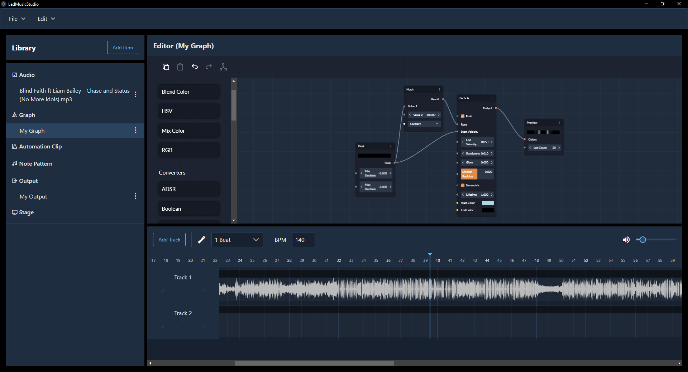

# LEDMusic Studio

A WIP music visualization editor based on Electron, Vue 3 and BaklavaJS.

## Local Setup

### Prerequisites
- [NodeJS](https://nodejs.org/)
- [Yarn v3](https://yarnpkg.com/)
- [Rust](https://www.rust-lang.org/)
- [wasm-pack](https://rustwasm.github.io/wasm-pack/installer/)

### Run locally
- Initial setup:
  - Install all dependencies using `yarn install`
  - Go to `src/rust`
  - Run `wasm-pack build --target web`
- Run `yarn electron:dev`
